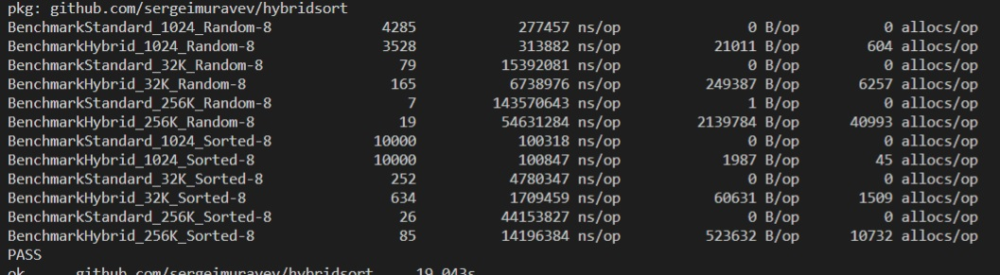

## Package hybridsort provides an example of stable, concurrent sorting algorithm based on timsort and symmerge algorithms.

*Usage: 
`import "github.com/sergeimuravev/hybridsort"`

The procedure works in a few steps:
- find pre-sorted chunks (called 'run') of size [MinRunSize, MaxRunSize] and run insertion sort in parallel
- push results into priority queue to restore sequence of runs
- fetch runs from priority queue and perform symmerge in parallel
- push back merged results into priority queue until the only one run found in the queue

### User settings are available:
- min and max run size
- degree of parallelism

*NOTE: symmerge implementation politely borrowed from https://golang.org/src/sort/sort.go

### Benchmarks
There are a few benchmarks comparing the performance of this algorithm with standard `sort.Stable()` function:

</img>

